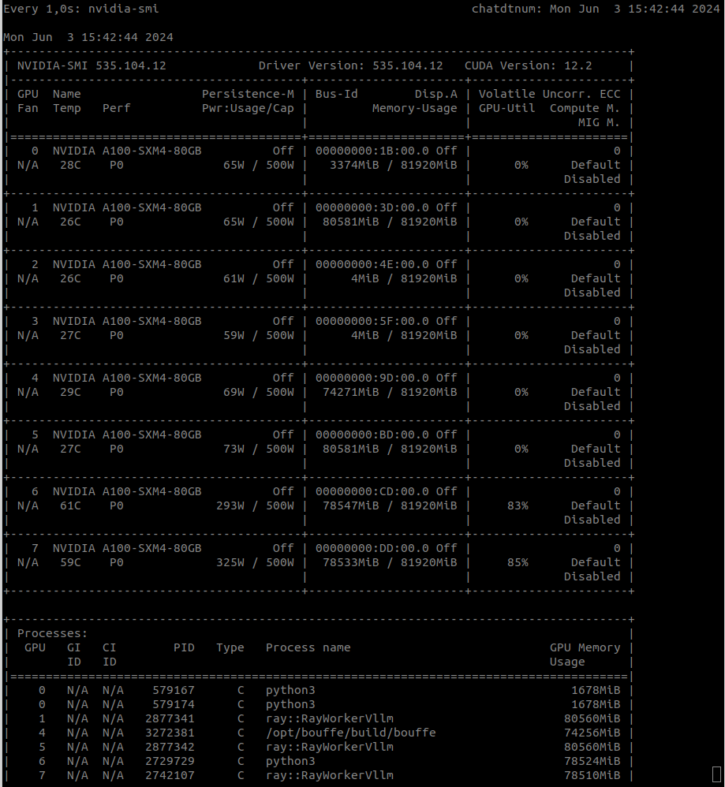

# PARTIE III. Deploiements

## 2. Socle avancé (Camille Jérôme Conrad)

Optimisation, Monitoring, UX/UI (CODE!)

### A. Outils pour surveiller les performances des GPU

Une fois l'infrastructure sécurisée, il est toujours utile de monitorer les performances des GPU, pour suivre l'impact de cette technologie, pour monitorer la charge et prévenir de la surcharge. Idéallement, l'on peut aussi imaginer suivre la consommation projet par projet pour reporter les lignes de budget et faire des bilans carbonne.

Selon les technologies de GPUs utilisées, il existe différents outils qui se conncectent aux infrastructure pour fournir des statistiques (notamment la mémoire utilisée, la bande passante et la température) :
* **nvidia-smi**
* **AMD Vantage**
* **GPU-Z**

Voici un exemple de résultat de statistiques extraites d'une infrastructure GPUs :

Il existe également d'autres moyens d'accéder à des GPUs que l'acquisition individuelle pour les administrations (voir Partie III.4).

### B. Des interfaces déjà disponibles pour vos modèles LLMs

Plusieurs initiatives permettent de déployer rapidement des interfaces de chat avec des modèles LLMs, voire des applications de RAG avec back et front. On peut remarquer :

- la WebUI du module FastChat
- l'application CARADOC, mise en open source par l'équipe DataScience de la DTNUM de la DGFiP, publication prévue pour fin juin 2024.

